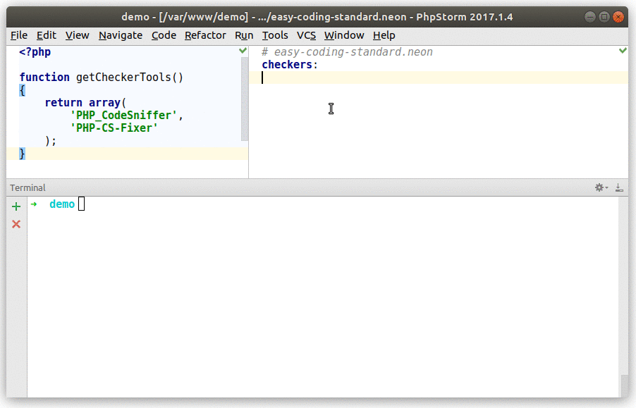
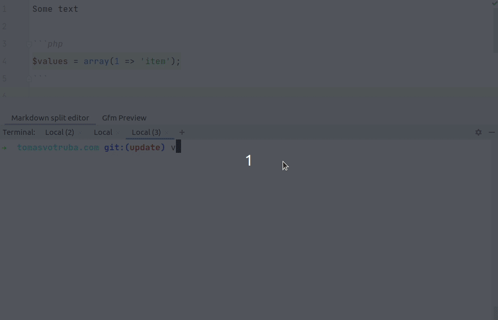

# The Easiest Way to Use Any Coding Standard

[](https://packagist.org/packages/symplify/easy-coding-standard/stats)



## Features

- **Blazing fast [Parallel run](#parallel-run)**
- Use [PHP_CodeSniffer || PHP-CS-Fixer](https://tomasvotruba.com/blog/2017/05/03/combine-power-of-php-code-sniffer-and-php-cs-fixer-in-3-lines/) - anything you like
- **2nd run under few seconds** with un-changed file cache
- Skipping files for specific checkers
- **Prepared sets** - PSR12, Symfony, arrays, use statements, spaces and more... - see `SetList` class for all
- **Prefixed version** by default to allow install without conflicts

Are you already using another tool?

- [How to Migrate From PHP_CodeSniffer to EasyCodingStandard in 7 Steps](https://www.tomasvotruba.com/blog/2018/06/04/how-to-migrate-from-php-code-sniffer-to-easy-coding-standard/#comment-4086561141)
- [How to Migrate From PHP CS Fixer to EasyCodingStandard in 6 Steps](https://www.tomasvotruba.com/blog/2018/06/07/how-to-migrate-from-php-cs-fixer-to-easy-coding-standard/)

## Install

```bash
composer require symplify/easy-coding-standard --dev
```

## Usage

### 1. Create Configuration and Setup Checkers

- Create an `ecs.php` in your root directory
- Add [Sniffs](https://github.com/squizlabs/PHP_CodeSniffer)
- ...or [Fixers](https://github.com/FriendsOfPHP/PHP-CS-Fixer) you'd love to use

```php
// ecs.php
use PhpCsFixer\Fixer\ArrayNotation\ArraySyntaxFixer;
use Symplify\EasyCodingStandard\Config\ECSConfig;
use Symplify\EasyCodingStandard\ValueObject\Set\SetList;

return static function (ECSConfig $ecsConfig): void {
    // A. full sets
    $ecsConfig->sets([SetList::PSR_12]);

    // B. standalone rule
    $ecsConfig->ruleWithConfiguration(ArraySyntaxFixer::class, [
        'syntax' => 'short',
    ]);
};
```

#### Full Sets before Standalone Rules

It is highly recommended to imports sets (A) first, then add standalone rules (B).

The reason for this is that some settings are configured in the full sets too, and will therefore overwrite your standalone rules, if not configured first.

### 2. Run in CLI

```bash
# dry
vendor/bin/ecs check src

# fix
vendor/bin/ecs check src --fix
```

## Features

How to load own config?

```bash
vendor/bin/ecs check src --config another-config.php
```

<br>

## Configuration

Configuration can be extended with many options. Here is list of them with example values and little description what are they for:

```php
use PhpCsFixer\Fixer\ArrayNotation\ArraySyntaxFixer;
use Symplify\EasyCodingStandard\Config\ECSConfig;

return static function (ECSConfig $ecsConfig): void {
    // alternative to CLI arguments, easier to maintain and extend
    $ecsConfig->paths([__DIR__ . '/src', __DIR__ . '/tests']);

    $ecsConfig->skip([
        // skip paths with legacy code
        __DIR__ . '/packages/*/src/Legacy',

        ArraySyntaxFixer::class => [
            // path to file (you can copy this from error report)
            __DIR__ . '/packages/EasyCodingStandard/packages/SniffRunner/src/File/File.php',

            // or multiple files by path to match against "fnmatch()"
            __DIR__ . '/packages/*/src/Command',
        ],

        // skip rule completely
        ArraySyntaxFixer::class,

        // just single one part of the rule?
        ArraySyntaxFixer::class . '.SomeSingleOption',

        // ignore specific error message
        'Cognitive complexity for method "addAction" is 13 but has to be less than or equal to 8.',
    ]);

    // scan other file extendsions; [default: [php]]
    $parameters = $ecsConfig->parameters();
    $parameters->set(Option::FILE_EXTENSIONS, ['php', 'phpt']);

    // configure cache paths & namespace - useful for Gitlab CI caching, where getcwd() produces always different path
    // [default: sys_get_temp_dir() . '/_changed_files_detector_tests']
    $parameters->set(Option::CACHE_DIRECTORY, '.ecs_cache');

    // [default: \Nette\Utils\Strings::webalize(getcwd())']
    $parameters->set(Option::CACHE_NAMESPACE, 'my_project_namespace');

    // indent and tabs/spaces
    // [default: spaces]
    $ecsConfig->indentation('tab');

    // [default: PHP_EOL]; other options: "\n"
    $ecsConfig->lineEnding("\r\n");
};
```

<br>

## Parallel Run

Do you have multi-core CPUs? ECS can run in *X* parallel threads, where *X* is number of your threads. E.g. with laptop with [AMD Ryzen 4750U](https://en.wikipedia.org/wiki/Ryzen) it is 16.

That means 1600 % faster run with same amount of analysed files. Did you code base took 16 minutes to fix? Now it's 1 minute.

It is enabled by default, so you can enjoy it out of the box.

## Coding Standards in Markdown



<br>

How to correct PHP snippets in Markdown files?

```bash
vendor/bin/ecs check-markdown README.md
vendor/bin/ecs check-markdown README.md docs/rules.md

# to fix them, add --fix
vendor/bin/ecs check-markdown README.md docs/rules.md --fix
```

Do you have already paths defined in `ecs.php` config? Drop them from CLI and let ECS use those:

```bash
vendor/bin/ecs check-markdown --fix
```

<br>

## FAQ

### How do I clear cache?

```bash
vendor/bin/ecs check src --clear-cache
```

<br>

## Report Issues

In case you are experiencing a bug or want to request a new feature head over to the [Symplify monorepo issue tracker](https://github.com/symplify/symplify/issues)

## Contribute

The sources of this package are contained in the Symplify monorepo. We welcome contributions for this package on [symplify/symplify](https://github.com/symplify/symplify).

## Acknowledgment

The parallel run is package is heavily inspired by [https://github.com/phpstan/phpstan-src](phpstan/phpstan-src) by Ondřej Mirtes. Thank you.
