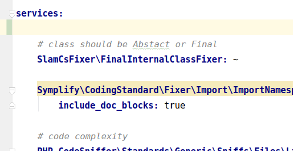
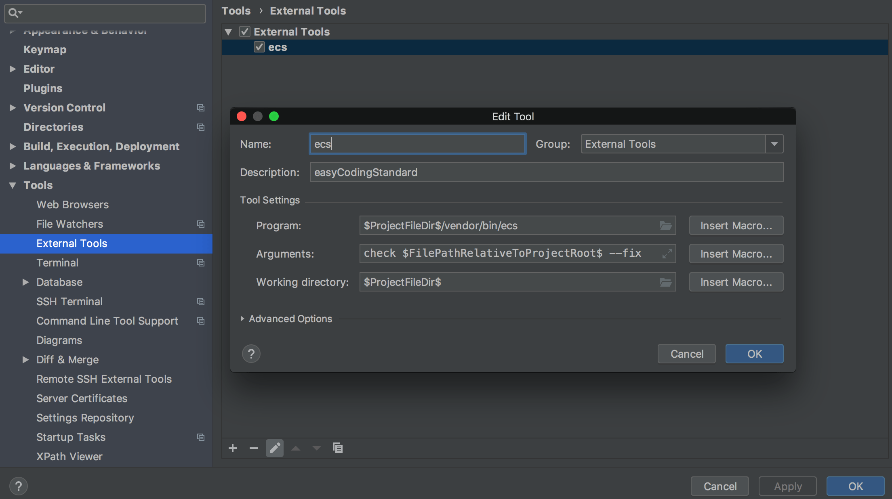

# The Easiest Way to Use Any Coding Standard

[](https://travis-ci.org/Symplify/EasyCodingStandard)
[](https://packagist.org/packages/symplify/easy-coding-standard/stats)


**Used by:**

<p align="center">
    <a href="https://github.com/lmc-eu/php-coding-standard"></a>
    
    <a href="https://github.com/nette/coding-standard"></a>
    
    <a href="https://github.com/php-ai/php-ml/"></a>
    <br>
    <br>
    <a href="https://github.com/shopsys/coding-standards"></a>
    
    <a href="https://github.com/sunfoxcz/coding-standard"></a>
    
    <a href="https://github.com/SyliusLabs/CodingStandard"></a>
</p>

## Features

- Use [PHP_CodeSniffer || PHP-CS-Fixer](https://www.tomasvotruba.cz/blog/2017/05/03/combine-power-of-php-code-sniffer-and-php-cs-fixer-in-3-lines/) - anything you like
- **2nd run under few seconds** with caching
- [Skipping files](#ignore-what-you-cant-fix) for specific checkers
- [Prepared checker sets](#use-prepared-checker-sets) - PSR2, Symfony, Common, Symplify and more...

Are you already using another tool?

- [How to Migrate From PHP_CodeSniffer to EasyCodingStandard in 7 Steps](https://www.tomasvotruba.cz/blog/2018/06/04/how-to-migrate-from-php-code-sniffer-to-easy-coding-standard/#comment-4086561141)
- [How to Migrate From PHP CS Fixer to EasyCodingStandard in 6 Steps](https://www.tomasvotruba.cz/blog/2018/06/07/how-to-migrate-from-php-cs-fixer-to-easy-coding-standard/)

## Install

```bash
composer require --dev symplify/easy-coding-standard
```

## Usage

### 1. Create Configuration and Setup Checkers

Create an `easy-coding-standard.yaml` in your root directory and add [Sniffs](https://github.com/squizlabs/PHP_CodeSniffer) or [Fixers](https://github.com/FriendsOfPHP/PHP-CS-Fixer) you'd love to use.

Let's start with the most common one - `array()` => `[]`:

```yaml
services:
    PhpCsFixer\Fixer\ArrayNotation\ArraySyntaxFixer:
        syntax: short
```

### 2. Run in CLI

```bash
# dry
vendor/bin/ecs check src

# fix
vendor/bin/ecs check src --fix
```

*Tip: Do you want [autocomplete too](https://github.com/Haehnchen/idea-php-symfony2-plugin/issues/1153)? Just use Symfony Plugin*



## More Features

### Use Prepared Checker Sets

There are prepared sets in [`/config/set` directory](config/set) that you can use:

- [clean-code.yaml](config/set/clean-code.yaml)
- [common.yaml](config/set/common.yaml)
- [php71.yaml](config/set/php71.yaml)
- [psr2.yaml](config/set/psr2.yaml)
- ...

You pick config in CLI with `--config`:

```bash
vendor/bin/ecs check src --config vendor/symplify/easy-coding-standard/config/set/clean-code.yaml
```

**Too long? Try `--level` shortcut**:

```bash
vendor/bin/ecs check src --level clean-code
```

or include more of them in config:

```yaml
# easy-coding-standard.yaml
imports:
    - { resource: 'vendor/symplify/easy-coding-standard/config/set/clean-code.yaml' }
    - { resource: 'vendor/symplify/easy-coding-standard/config/set/psr2.yaml' }
```

In case of [custom coding standard and include](https://github.com/lmc-eu/php-coding-standard/pull/6/files#diff-a8b950982764fcffe4b7b3acd261cf91) e.g. `psr2.yaml` form this package, you might want to use `%vendor_dir%` or `%current_working_dir%` for:

```yaml
# lmc-coding-standard.yaml
imports:
    - { resource: '%vendor_dir%/symplify/easy-coding-standard/config/set/psr2.yaml' }
    # or
    - { resource: '%current_working_dir%/vendor/symplify/easy-coding-standard/config/set/psr2.yaml' }
```

That would load file always from vendor dir, no matter where you are.

### Exclude Checkers

What if you add `symfony.yaml` set, but don't like `PhpCsFixer\Fixer\PhpTag\BlankLineAfterOpeningTagFixer`?

```yaml
imports:
    - { resource: 'vendor/symplify/easy-coding-standard/config/set/symfony.yaml' }

parameters:
    skip:
        PhpCsFixer\Fixer\PhpTag\BlankLineAfterOpeningTagFixer: ~
```

### Include Checkers Only  for Some Paths

This feature is the exact opposite of *skip*. Do you want to run your rule only on new code? Limit it with `only` parameter:

```yaml
services:
    Symplify\CodingStandard\Sniffs\Naming\AbstractClassNameSniff: ~

parameters:
    only:
        Symplify\CodingStandard\Sniffs\Naming\AbstractClassNameSniff:
            - 'src/NewCode/*'
```

### Ignore What You Can't Fix

Sometimes, checker finds an error in code that inherits from code you can't change.

No worries! Just **skip checker for this file**:

```yaml
parameters:
    skip:
        SlevomatCodingStandard\Sniffs\TypeHints\TypeHintDeclarationSniff:
            # relative path to file (you can copy this from error report)
            - 'packages/EasyCodingStandard/packages/SniffRunner/src/File/File.php'

            # or multiple files by path to match against "fnmatch()"
            - '*packages/CodingStandard/src/Sniffs/*/*Sniff.php'
```

You can also skip specific codes or messages that you know from PHP_CodeSniffer:

```yaml
parameters:
    skip:
        # code to skip for all files
        SlevomatCodingStandard\Sniffs\TypeHints\TypeHintDeclarationSniff.UselessDocComment: ~

        # same syntax is used for skipping specific sniff messages
        'Cognitive complexity for method "addAction" is 13 but has to be less than or equal to 8.': ~

        # code to skip for specific files/patterns
        SlevomatCodingStandard\Sniffs\TypeHints\TypeHintDeclarationSniff.MissingTraversableParameterTypeHintSpecification:
            -  '*src/Form/Type/*Type.php'
```

Or just 2 files?

```yaml
parameters:
    exclude_files:
        # generated files
        - 'lib/PhpParser/Parser/Php5.php'
        - 'lib/PhpParser/Parser/Php7.php'
        # or with fnmatch() pattern
        - '*/lib/PhpParser/Parser/Php*.php'
```

### Do you need to Include tests, `*.php`, `*.inc` or `*.phpt` files?

Normally you want to exclude these files, because they're not common code - they're just test files or dummy fixtures. In case you want to check them as well, **you can**.

Let's say you want to include `*.phpt` files.

- Create a class in `src/Finder/PhpAndPhptFilesProvider.php`
- Implement `Symplify\EasyCodingStandard\Contract\Finder\CustomSourceProviderInterface`
- Register it as services to `easy-coding-standard.yaml` like any other Symfony service:

    ```yaml
    services:
        App\Finder\PhpAndPhptFilesProvider: ~
    ```

The `PhpAndPhptFilesProvider` might look like this:

```php
namespace App\Finder;

use IteratorAggregate;
use Nette\Utils\Finder;
use SplFileInfo;
use Symplify\EasyCodingStandard\Contract\Finder\CustomSourceProviderInterface;

final class PhpAndPhptFilesProvider implements CustomSourceProviderInterface
{
    /**
     * @param string[] $source
     * @return mixed[]
     */
    public function find(array $source)
    {
        # $source is "source" argument passed in CLI
        # inc CLI: "vendor/bin/ecs check /src" => here: ['/src']
        return Finder::find('*.php', '*.phpt')->in($source);
    }
}
```

*Don't forget to autoload it with composer.*

**Use any Finder you like**: [Nette\Finder](https://doc.nette.org/en/finder) or [Symfony\Finder](https://symfony.com/doc/current/components/finder.html).
You can also return array of files or `SplFileInfo`s.

### FAQ

#### How can I see all loaded checkers?

```bash
vendor/bin/ecs show
vendor/bin/ecs show --config ...
```

#### How do I find checkers by group or type?

```bash
vendor/bin/ecs find
vendor/bin/ecs find symplify # for Symplify rules
vendor/bin/ecs find array # for array-related rules
```

#### How do I clear cache?

```bash
vendor/bin/ecs check src --clear-cache
```

#### How can I change the cache directory?

```yaml
parameters:
    cache_directory: .ecs_cache # defaults to sys_get_temp_dir() . '/_easy_coding_standard/_changed_files_detector_tests'
```

#### Can I use tabs, 2 spaces or "\r\n" line endings?

```yaml
parameters:
    indentation: "tab" # "spaces" by default, you can also use "  " (2 spaces), "    " (4 spaces) or "	" (tab)
    line_ending: "\r\n" # PHP_EOL by default; you can also use "\n"
```

## Your IDE Integration

### PHPStorm

EasyCodingStandard can be used as an External Tool



Go to `Preferences` > `Tools` > `External Tools` and click `+` to add a new tool.

- Name: `ecs` (Can be any value)
- Description: `easyCodingStandard` (Can be any value)
- Program: `$ProjectFileDir$/vendor/bin/ecs` (Path to `ecs` executable; On Windows path separators must be a `\`)
- Parameters: `check $FilePathRelativeToProjectRoot$` (append `--fix` to auto-fix)
- Working directory: `$ProjectFileDir$`

Press `Cmd/Ctrl` + `Shift` + `A` (Find Action), search for `ecs`, and then hit Enter. It will run `ecs` for the current file.

To run `ecs` on a directory, right click on a folder in the project browser go to external tools and select `ecs`.

You can also create a keyboard shortcut in [Preferences > Keymap](https://www.jetbrains.com/help/webstorm/configuring-keyboard-and-mouse-shortcuts.html) to run `ecs`.

### Visual Studio Code

[EasyCodingStandard for Visual Studio Code](https://marketplace.visualstudio.com/items?itemName=azdanov.vscode-easy-coding-standard) extension adds support for running EasyCodingStandard inside the editor.

## Tool Integration
| Tool | Extension | Description |
| ---- | --------- | ----------- |
| [GrumPHP](https://github.com/phpro/grumphp) | [nlubisch/grumphp-easycodingstandard](https://github.com/nlubisch/grumphp-easycodingstandard) | Provides a new task for GrumPHP which runs ECS |

## Contributing

Send [issue](https://github.com/Symplify/Symplify/issues) or [pull-request](https://github.com/Symplify/Symplify/pulls) to main repository.
